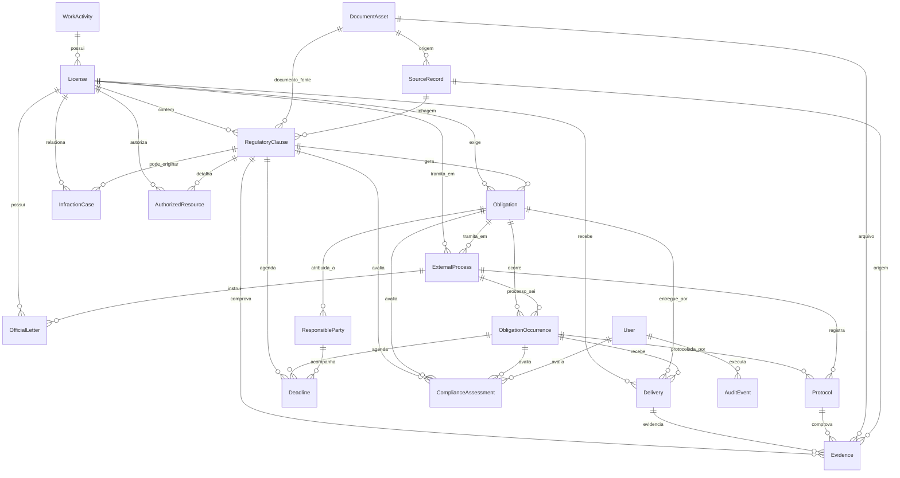

# Visualizacao do Banco de Dados

Este documento complementa o `prisma/schema.prisma` com uma visao operacional do modelo. A rota `GET /api/database/docs` continua sendo a fonte navegavel gerada automaticamente a partir do Prisma DMMF.

## Prisma Studio

Use o Prisma Studio para visualizar e editar dados localmente:

```bash
docker compose up -d postgres
npm run db:studio
```

## Modelo Suape

O schema foi ajustado a partir da validacao em `output/docs/validacao_schema_backend_com_documentos_reais_suape.md`.

Principais entidades:

- `License`: licencas e autorizacoes com tipo oficial, validade, regra de renovacao e identificadores CPRH, SILIA, SISAM, SEI e oficio Suape.
- `RegulatoryClause`: clausulas regulatorias extraidas dos documentos oficiais, preservando `itemCode` como texto para itens como `4.10` e `12.1`.
- `Obligation`: obrigacoes operacionais derivadas das clausulas, com tipo, gatilho, prazos interno/externo, recorrencia, peso e criticidade.
- `ObligationOccurrence`: ocorrencias de prazo usadas para gerar o calendario GML por periodo/ano.
- `Delivery`: entregas e comprovacoes de cumprimento, separadas de evidencia documental e protocolo.
- `ExternalProcess`: processos CPRH, SISAM, SILIA, SEI, ANM, IBAMA ou outros, vinculaveis a licencas e obrigacoes.
- `OfficialLetter`: oficios Suape ou documentos oficiais vinculados a processo/licenca.
- `ComplianceAssessment`: avaliacao auditavel de atendimento, substituindo colunas soltas como atende/parcial/nao atende e ponderacao.
- `InfractionCase`: autos de infracao e passivos ambientais.
- `AuthorizedResource`: materiais, equipamentos e equipe tecnica autorizados por clausulas de autorizacao ambiental.

## Diagrama ER Resumido



## Regras Importantes

- `RegulatoryClause.itemCode` e `SourceRecord.itemCode` sao `String`; nunca converter itens de planilha como `4.9`, `4.10` ou `12.1` para numero/data.
- Evidencia, entrega e protocolo sao entidades diferentes: um relatorio pode ser evidencia, a submissao pode ser entrega e o comprovante CPRH pode ser protocolo.
- O calendario GML deve ser derivado de `ObligationOccurrence`, nao mantido como uma tabela manual isolada.
- Processos externos devem ser normalizados em `ExternalProcess`, evitando misturar SEI, CPRH, SISAM e SILIA em observacoes livres.
